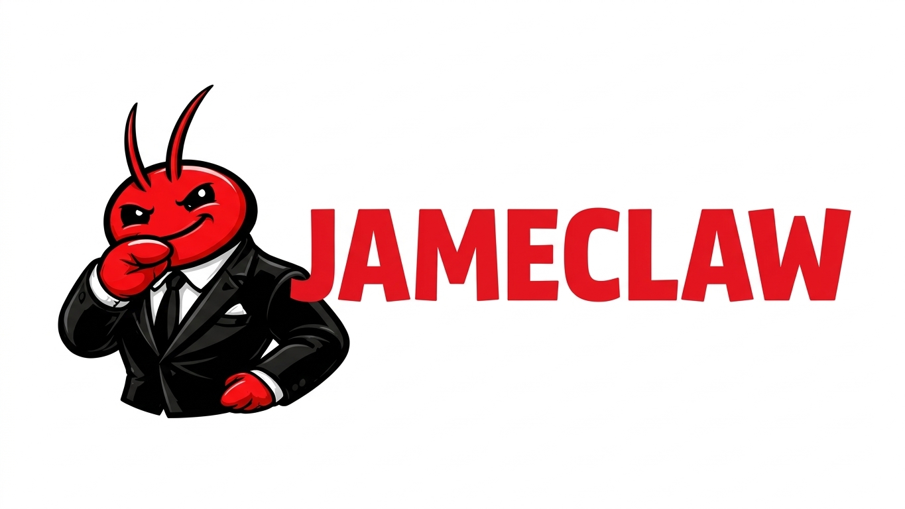
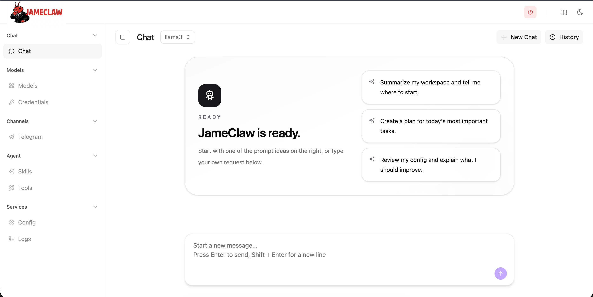
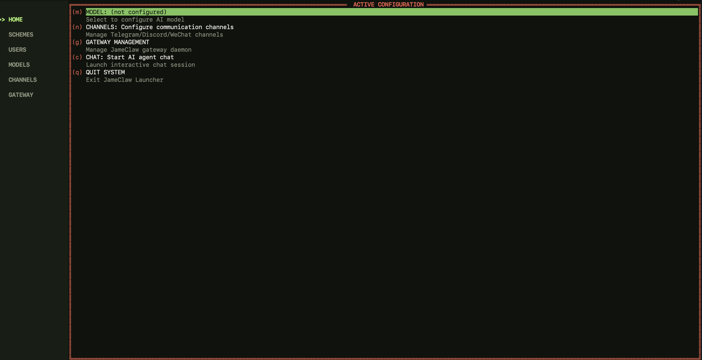

<div align="center">


<h1>TrenchClaw: Local-First AI Assistant in Go</h1>

<h3>Web Console · TUI Launcher · Multi-Channel Gateway</h3>
  <p>
    
    
    
    <br>
    
    
    
    
    
    <br>
    <a href="https://trenchlaw.xyz/"></a>
    <a href="https://trenchlaw.xyz/docs/"></a>
  </p>

**English**

</div>

---

> **TrenchClaw** is a local-first AI assistant written in **Go** with a browser launcher, terminal launcher, and multi-channel gateway.

This repository is tuned around the workflow that exists in the code today:

- run a local web console at `http://localhost:18800`
- manage credentials, models, channels, tools, skills, config, and logs from one UI
- keep runtime state under `~/.trenchlaw`
- use the TUI launcher when working over SSH or on headless machines

If you are using this fork day to day, the launcher experience is the main entry point, not the older promo-heavy hardware/demo copy.

## 🧭 How TrenchClaw Works

TrenchClaw in this repo is one local agent with four practical entry points:

- **Web Console**: browser UI for chat, credentials, models, channels, tools, config, launcher settings, and logs
- **TUI Launcher**: terminal dashboard for headless servers, SSH sessions, and Raspberry Pi-style setups
- **Terminal Agent**: direct CLI chat with `trenchlaw agent` for one-shot questions or interactive sessions
- **Gateway**: background bridge that connects the same agent and config to Telegram and other channels

All of those entry points share the same local runtime state under `~/.trenchlaw`.

## 🎯 What The Agent Does

- uses your configured default model to chat and act on your local workspace
- keeps one local config source for models, channels, skills, tools, and runtime behavior
- lets you manage setup visually in the Web Console, from menus in the TUI, or directly from the CLI
- can expose the same agent through chat apps once the gateway is running
- stores workspace templates, logs, auth state, and launcher settings locally

> [!CAUTION]
> **Security Notice**
>
> * **NO CRYPTO:** TrenchClaw has **not** issued any official tokens or cryptocurrency. All claims on `pump.fun` or other trading platforms are **scams**.
> * **OFFICIAL DOMAIN:** The **ONLY** official website is **[trenchlaw.xyz](https://trenchlaw.xyz/)**
> * **BEWARE:** Many `.ai/.org/.com/.net/...` domains have been registered by third parties. Do not trust them.
> * **NOTE:** TrenchClaw is in early rapid development. There may be unresolved security issues. Do not deploy to production before v1.0.
> * **NOTE:** TrenchClaw has recently merged many PRs. Recent builds may use 10-20MB RAM. Resource optimization is planned after feature stabilization.

## ✨ What This Fork Focuses On

- **Web console first**: local browser UI for chat, configuration, and day-to-day operations
- **Launcher workflow**: launcher settings, auto-start support, gateway controls, and logs
- **Provider management**: dedicated credentials and models pages with one local config source
- **Channel management**: configure Telegram, Discord, Slack, Matrix, LINE, WeCom, Feishu, OneBot, MaixCam, and more from one place
- **Agent operations**: inspect tools, skills, raw config, and runtime status without leaving the app
- **Desktop and headless use**: browser launcher for local use and TUI launcher for SSH/server workflows

## 🗂️ Project Layout

- `web/frontend`: React/TanStack web console
- `web/backend`: Go launcher backend and embedded UI server
- `cmd/trenchlaw-launcher-tui`: terminal launcher for headless environments
- `cmd/trenchlaw`: CLI entry point for onboarding, chat, gateway control, and auth flows
- `pkg/`: providers, channels, tools, config, gateway, memory, and shared runtime packages

For broader product docs, use the official docs site. This README is intentionally focused on the current launcher-centric setup in this repo.

## 📦 Install

### Download from trenchlaw.xyz (Recommended)

Visit **[trenchlaw.xyz](https://trenchlaw.xyz/)** — the official website auto-detects your platform and provides one-click download. No need to manually pick an architecture.

Install and setup docs: **[trenchlaw.xyz/docs](https://trenchlaw.xyz/docs/)**.

After installing the binary, the first setup step is:

```bash
trenchlaw install
```

`trenchlaw` by itself no longer starts onboarding automatically. On a fresh machine, or after `trenchlaw uninstall`, run `trenchlaw install` first, then run `trenchlaw` normally.

### Download precompiled binary

Alternatively, download the binary for your platform from the [GitHub Releases](./releases) page.

### Install via npm

If you prefer a Node-based install flow, TrenchLaw can also be installed through npm. The npm package is a thin wrapper that downloads the native release binary for your platform during install.

```bash
npm install -g trenchlaw
trenchlaw install
```

If you want to skip the download during package installation, set `TRENCHLAW_NPM_SKIP_DOWNLOAD=1` and let the wrapper fetch the binary on first run instead.

### Build from source (for development)

```bash
git clone <repository-url>

cd trenchlaw
make deps

# Build core binary
make build

# Build Web UI Launcher (required for WebUI mode)
make build-launcher

# Optional: build the TUI launcher
go build -o build/trenchlaw-launcher-tui ./cmd/trenchlaw-launcher-tui

# Build for multiple platforms
make build-all

# Build for Raspberry Pi Zero 2 W (32-bit: make build-linux-arm; 64-bit: make build-linux-arm64)
make build-pi-zero

# Build and install
make install
```

**Raspberry Pi Zero 2 W:** Use the binary that matches your OS: 32-bit Raspberry Pi OS -> `make build-linux-arm`; 64-bit -> `make build-linux-arm64`. Or run `make build-pi-zero` to build both.

## 🚀 Quick Start Guide

### ✅ First-Time Setup

There are two different first-run paths in this repo:

- **Core CLI**: run `trenchlaw install` first, then run `trenchlaw`
- **Web Console / launcher**: the launcher can create the initial config automatically if it does not exist

If you want to wipe the local setup and start again from scratch:

```bash
trenchlaw uninstall
trenchlaw install
```

### 🌐 WebUI Launcher (Recommended for Desktop)

The WebUI Launcher is the main workflow in this repo. It provides a browser-based interface for configuration, credentials, models, channels, tools, skills, logs, and chat.

**Option 1: Double-click (Desktop)**

After downloading from [trenchlaw.xyz](https://trenchlaw.xyz/), double-click `trenchlaw-launcher` (or `trenchlaw-launcher.exe` on Windows). Your browser will open automatically at `http://localhost:18800`.

**Option 2: Command line**

```bash
trenchlaw-launcher
# Open http://localhost:18800 in your browser
```

If port `18800` is already in use, stop the existing launcher or start on another port with `trenchlaw-launcher -port 18801`.

> [!TIP]
> **Remote access / Docker / VM:** Add the `-public` flag to listen on all interfaces:
> ```bash
> trenchlaw-launcher -public
> ```

<p align="center">

</p>

**Getting started:** 

Open the WebUI, then:

**1)** Add a credential  
**2)** Add or select a model  
**3)** Enable the channel you want to use  
**4)** Review launcher/config settings and start the gateway  
**5)** Use the chat and logs pages to verify everything is working

If you are using the core CLI without the launcher, the first command is `trenchlaw install`, not bare `trenchlaw`.

For detailed WebUI documentation, see [docs.trenchlaw.io](https://docs.trenchlaw.io).

<details>
<summary><b>Docker (alternative)</b></summary>

```bash
# 1. Clone this repo
git clone <repository-url>
cd trenchlaw

# 2. First run — auto-generates docker/data/config.json then exits
#    (only triggers when both config.json and workspace/ are missing)
docker compose -f docker/docker-compose.yml --profile launcher up
# The container prints "First-run setup complete." and stops.

# 3. Set your API keys
vim docker/data/config.json

# 4. Start
docker compose -f docker/docker-compose.yml --profile launcher up -d
# Open http://localhost:18800
```

> **Docker / VM users:** The Gateway listens on `127.0.0.1` by default. Set `TRENCHLAW_GATEWAY_HOST=0.0.0.0` or use the `-public` flag to make it accessible from the host.

```bash
# Check logs
docker compose -f docker/docker-compose.yml logs -f

# Stop
docker compose -f docker/docker-compose.yml --profile launcher down

# Update
docker compose -f docker/docker-compose.yml pull
docker compose -f docker/docker-compose.yml --profile launcher up -d
```

</details>

### 💻 TUI Launcher (Recommended for Headless / SSH)

The TUI (Terminal UI) Launcher provides a full-featured terminal interface for configuration and management. Ideal for servers, Raspberry Pi, and other headless environments.

```bash
trenchlaw-launcher-tui
```

<p align="center">

</p>

**Getting started:** 

Use the TUI menus to: **1)** Configure credentials and models -> **2)** Enable a channel -> **3)** Start the gateway -> **4)** Monitor logs and chat.

For detailed TUI documentation, see [docs.trenchlaw.io](https://docs.trenchlaw.io).

### ⌨️ Terminal Agent

If you want the fastest path without the launchers, use the core CLI agent directly:

```bash
trenchlaw install
trenchlaw agent
```

Or send a one-shot message:

```bash
trenchlaw agent -m "Summarize this workspace and tell me where to start."
```

This mode is the best fit when you want a direct shell workflow instead of the browser UI or TUI.

### 📱 Android

Give your decade-old phone a second life! Turn it into a smart AI Assistant with TrenchLaw.

**Option 1: Termux (available now)**

1. Install [Termux](https://github.com/termux/termux-app) (download from [GitHub Releases](https://github.com/termux/termux-app/releases), or search in F-Droid / Google Play)
2. Run the following commands:

```bash
# Download the latest release
wget <releases-url>/latest/download/trenchlaw_Linux_arm64.tar.gz
tar xzf trenchlaw_Linux_arm64.tar.gz
pkg install proot
termux-chroot ./trenchlaw install   # chroot provides a standard Linux filesystem layout
```

Then follow the Terminal Launcher section below to complete configuration.

**Option 2: APK Install (coming soon)**

A standalone Android APK with built-in WebUI is planned.

<details>
<summary><b>Terminal Launcher (for resource-constrained environments)</b></summary>

For minimal environments where only the `trenchlaw` core binary is available (no Launcher UI), you can configure everything via the command line and a JSON config file.

**1. Initialize**

```bash
trenchlaw install
```

This creates `~/.trenchlaw/config.json` and the workspace directory.

After setup is complete, run `trenchlaw` again to choose how to start, or use `trenchlaw agent` directly.

**2. Configure** (`~/.trenchlaw/config.json`)

```json
{
  "agents": {
    "defaults": {
      "model_name": "gpt-5.4"
    }
  },
  "model_list": [
    {
      "model_name": "gpt-5.4",
      "model": "openai/gpt-5.4",
      "api_key": "sk-your-api-key"
    }
  ]
}
```

> See `config/config.example.json` in the repo for a complete configuration template with all available options.

**3. Chat**

```bash
# One-shot question
trenchlaw agent -m "What is 2+2?"

# Interactive mode
trenchlaw agent

# Start gateway for chat app integration
trenchlaw gateway
```

</details>

## 🔌 Models And Providers

The agent runs on whichever default model you configure in `config.json`.

In this fork, the practical setup paths are:

- add API-key-based models from the Web Console credentials and models pages
- pick a local model such as Ollama for offline or self-hosted use
- switch the default model from the Web Console, TUI, or `trenchlaw model`

Common provider families include OpenAI, Anthropic, OpenRouter, local Ollama, and other OpenAI-compatible backends. For the full provider matrix and advanced configuration, see [Providers & Models](docs/providers.md).

<details>
<summary><b>Local deployment (Ollama, vLLM, etc.)</b></summary>

**Ollama:**
```json
{
  "model_list": [
    {
      "model_name": "local-llama",
      "model": "ollama/llama3.1:8b",
      "api_base": "http://localhost:11434/v1"
    }
  ]
}
```

**vLLM:**
```json
{
  "model_list": [
    {
      "model_name": "local-vllm",
      "model": "vllm/your-model",
      "api_base": "http://localhost:8000/v1"
    }
  ]
}
```

For full provider configuration details, see [Providers & Models](docs/providers.md).

</details>

## 💬 Channels And Gateway

The gateway is how the same local agent is exposed to chat apps.

Typical flow:

- configure a channel in the Web Console, TUI, or config file
- start the gateway
- talk to the same agent through that channel using the same local model and workspace

This fork is most clearly tuned around Telegram-first setup in onboarding, but the codebase also includes broader channel support. For the full channel list and setup guides, see [Chat Apps Configuration](docs/chat-apps.md).

## 🔧 Tools

The agent can be given tools such as shell execution, web search, webhook posting, MCP servers, and skills. In this repo, the main user-facing place to inspect and manage tool availability is the Web Console tools page. Workspace-specific tool notes can also live in `workspace/TOOLS.md` for local names, hosts, devices, webhook URLs, and other environment details that should not be embedded into shared skills.

For full tool configuration details, see [Tools Configuration](docs/tools_configuration.md).

## 🎯 Skills

Skills are modular capabilities that extend your agent. They are loaded from `SKILL.md` files in your workspace and can be managed from the Web Console or the CLI.

**Install skills from ClawHub:**

```bash
trenchlaw skills search "web scraping"
trenchlaw skills install <skill-name>
```

**Configure ClawHub token** (optional, for higher rate limits):

Add to your `config.json`:
```json
{
  "tools": {
    "skills": {
      "registries": {
        "clawhub": {
          "auth_token": "your-clawhub-token"
        }
      }
    }
  }
}
```

For more details, see [Tools Configuration - Skills](docs/tools_configuration.md#skills-tool).

## 🔗 MCP (Model Context Protocol)

TrenchLaw supports [MCP](https://modelcontextprotocol.io/) so the agent can use external tools and data sources beyond the built-in runtime.

```json
{
  "tools": {
    "mcp": {
      "enabled": true,
      "servers": {
        "filesystem": {
          "enabled": true,
          "command": "npx",
          "args": ["-y", "@modelcontextprotocol/server-filesystem", "/tmp"]
        }
      }
    }
  }
}
```

For full MCP configuration (stdio, SSE, HTTP transports, Tool Discovery), see [Tools Configuration - MCP](docs/tools_configuration.md#mcp-tool).

## 🖥️ CLI Reference

| Command                   | Description                      |
| ------------------------- | -------------------------------- |
| `trenchlaw`                | Start the default chooser after setup |
| `trenchlaw install`        | Initialize config & workspace    |
| `trenchlaw onboard`        | Legacy alias for install         |
| `trenchlaw uninstall`      | Remove local state and reset setup |
| `trenchlaw agent -m "..."` | Chat with the agent              |
| `trenchlaw agent`          | Interactive chat mode            |
| `trenchlaw gateway`        | Start the gateway                |
| `trenchlaw status`         | Show status                      |
| `trenchlaw version`        | Show version info                |
| `trenchlaw model`          | View or switch the default model |
| `trenchlaw cron list`      | List all scheduled jobs          |
| `trenchlaw cron add ...`   | Add a scheduled job              |
| `trenchlaw cron disable`   | Disable a scheduled job          |
| `trenchlaw cron remove`    | Remove a scheduled job           |
| `trenchlaw skills list`    | List installed skills            |
| `trenchlaw skills install` | Install a skill                  |
| `trenchlaw migrate`        | Migrate data from older versions |
| `trenchlaw auth login`     | Authenticate with providers      |

### ⏰ Scheduled Tasks / Reminders

TrenchLaw supports scheduled reminders and recurring tasks through the `cron` tool:

* **One-time reminders**: "Remind me in 10 minutes" -> triggers once after 10min
* **Recurring tasks**: "Remind me every 2 hours" -> triggers every 2 hours
* **Cron expressions**: "Remind me at 9am daily" -> uses cron expression

## 📚 Documentation

For detailed guides beyond this README:

| Topic | Description |
|-------|-------------|
| [Docker & Quick Start](docs/docker.md) | Docker Compose setup, Launcher/Agent modes |
| [Chat Apps](docs/chat-apps.md) | Channel setup guides and gateway behavior |
| [Configuration](docs/configuration.md) | Environment variables, workspace layout, security sandbox |
| [Providers & Models](docs/providers.md) | Provider setup, model routing, and `model_list` configuration |
| [Spawn & Async Tasks](docs/spawn-tasks.md) | Quick tasks, long tasks with spawn, async sub-agent orchestration |
| [Hooks](docs/hooks/README.md) | Event-driven hook system: observers, interceptors, approval hooks |
| [Steering](docs/steering.md) | Inject messages into a running agent loop between tool calls |
| [SubTurn](docs/subturn.md) | Subagent coordination, concurrency control, lifecycle |
| [Troubleshooting](docs/troubleshooting.md) | Common issues and solutions |
| [Tools Configuration](docs/tools_configuration.md) | Per-tool enable/disable, exec policies, MCP, Skills |
| [Hardware Compatibility](docs/hardware-compatibility.md) | Tested boards, minimum requirements |
